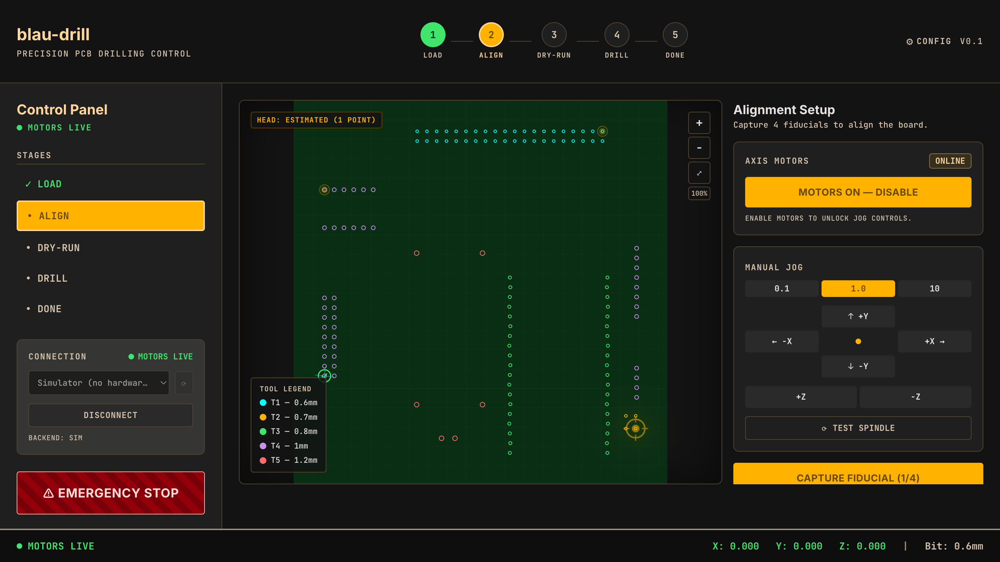
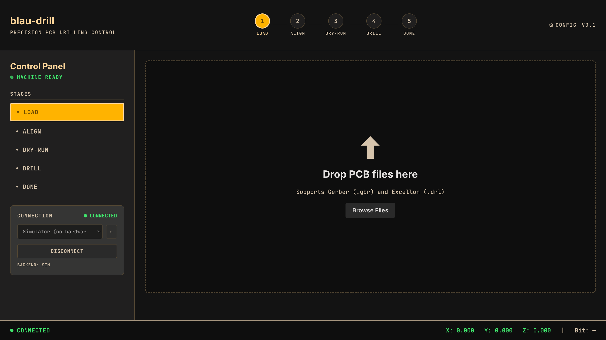
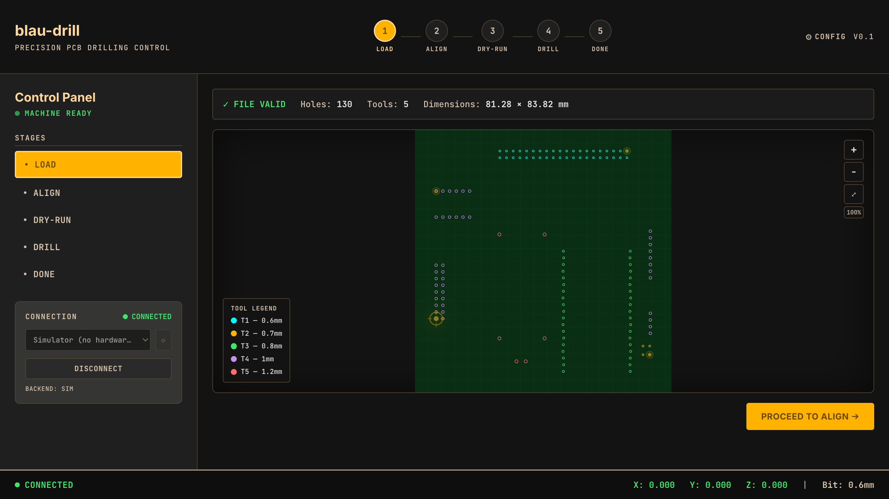
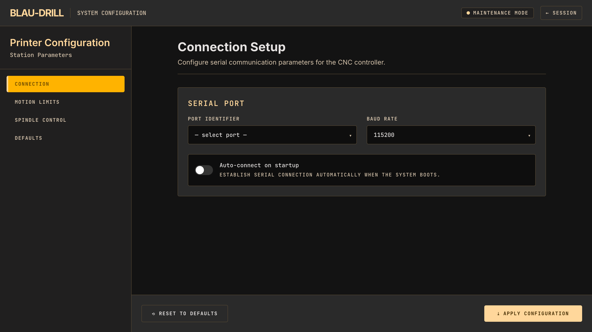

# blau-drill

**A single-operator desktop app that drives a modified 3D printer to drill PCBs.**

blau-drill turns a digital board design (KiCad Excellon `.drl`) into physical
machine movement, guiding the operator through a strictly linear, safety-gated
workflow:

> **Load & Connect → Physical Alignment → Dry-run → Active Drilling → Completion**

It replaces a hand-rolled chain (re-export, a mirror flag, a fiducial `G92`,
`pcb2gcode`, and a Python post-processor) with one guided flow where the *wrong
order is unrepresentable* — you cannot drill before a dry-run, cannot fit an
alignment from too few points, and cannot jog a de-energized axis.

Built with **Elixir / Phoenix LiveView** and a **Svelte** board canvas, talking
to **Marlin** over a live serial link.



---

## Why it exists

Drilling a PCB on a converted 3D printer means solving a few hard, *physical*
problems at once:

- **The board is never square to the bed.** Its position, rotation, and
  (when drilled from the back) mirror have to be measured, not assumed.
- **A drill bit dragged sideways while buried in the board snaps.** Every
  traverse between holes has to retract to a safe height first.
- **Marlin has quirks.** The spindle shares the laser PWM, so the duty must be
  on the `M3` line (`M3 S255`) — a bare `M3` only toggles the enable pin. And a
  de-energized stepper snaps 1–2 mm to the nearest full step when it re-engages,
  ruining alignment.

blau-drill encodes the hard-won answers to these directly into its types and
state machines, so the dangerous mistakes are *designed out* rather than
documented.

## The five-stage flow

| Stage | What happens |
| ----- | ------------ |
| **Load & Connect** | Pick the printer device (the **Simulator**, or a real USB serial port detected on the computer). Drop a KiCad `.drl`; it's parsed into holes, tools, and a bounding box, with diagnostics (a malformed or absolute-page export is rejected loudly). |
| **Physical Alignment** | Energize the motors, jog the head onto 3–4 board features, and capture each. blau-drill fits a least-squares **affine transform** (translation + rotation + mirror + skew) and reports its **residuals** — the trust signal. Only the current target blinks; click any point to jump the head there. |
| **Dry-run** | Stream the program with the **spindle off**, hovering 0.2 mm over every hole, so you confirm registration against the real board before anything cuts. |
| **Active Drilling** | Stream the real program — `M3 S255`, plunge, per-tool bit-change pauses — with live per-hole progress and telemetry. Prominent **Abort** / **E-Stop**. |
| **Completion** | Session summary; robust fault-recovery if the hardware disconnects mid-run. |

## Safety is the architecture

The interesting part of blau-drill is that its safety properties are **structural** —
enforced by types and a state machine, proven by property-based tests — not by
careful UI code:

- **Never traverse XY without Z safe.** Every move goes through a `safe_move`
  combinator that always retracts to `zsafe` first. A property test parses every
  generated program and asserts no `X/Y` move ever happens while `Z < zsafe`.
- **Spindle on before any plunge.** In drill mode, every plunge is preceded by
  `M3 S255` with no intervening `M5`. In dry-run, the spindle stays off and Z
  never goes negative.
- **Energize before jog.** The `PrinterConnection` (`:gen_statem`) exposes *no*
  jog command in its `:idle` state — the only path to `:jogging` runs an energize
  step first, as the state's entry action. The 1–2 mm snap is unreachable.
- **No drilling before a dry-run.** The `Job` FSM has no edge from `:aligned`
  straight to `:drilling`; it must route through `:dry_run`. The "Start Drilling"
  control literally does not exist until you've dry-run, and the server refuses a
  forged event.
- **Alignment can't be unsolvable.** There is no public constructor for an
  `Alignment` — only `Alignment.fit/1`, which returns one only for ≥3
  non-collinear points and carries its residuals. Fewer points are a *different*
  type that has no transform field.

The board→machine X-mirror that pcb2gcode did with a `drill-side=back` flag is
absorbed entirely into the fitted affine transform. Native G-code generation is
verified by diffing against golden `pcb2gcode` output — **zero instruction-line
differences**.

## Architecture at a glance

A pipeline of pure, immutable values, with exactly one stateful identity: the
serial link.

```
KiCad .drl ─▶ BoardModel ─▶ Registration ─▶ Alignment.fit ─▶ GcodeProgram.build
 (parse edge)  (holes in    (capture        (affine +        (dry-run | drill)
               board coords) correspondences) residuals)            │
                                                                     ▼
                              PrinterConnection (:gen_statem, owns the serial port)
```

| Module | Role |
| ------ | ---- |
| `Transform2D` | A composable, invertible 2×3 affine value (board → machine). |
| `Alignment` / `PendingAlignment` | Least-squares affine fit with residuals; the smart constructor that makes an unsolvable alignment unrepresentable. |
| `BoardModel` | The parsing edge — Excellon `.drl` → holes / tools / bbox in board coordinates. |
| `GcodeProgram` | Native Marlin generation; where the two safety invariants live. |
| `PrinterConnection` | The one stateful identity — a supervised `:gen_statem` owning the serial port, hiding the Marlin handshake behind `jog` / `where` / `stream` / `halt`. |
| `Job` | A pure `transition/2` FSM that makes the linear flow the only legal path. |

A foundation-first design report lives in
[`docs/blau-drill-architecture.html`](docs/blau-drill-architecture.html), the
domain glossary in [`CONTEXT.md`](CONTEXT.md), and the load-bearing decisions in
[`docs/adr/`](docs/adr/).

## Screenshots

| | |
| --- | --- |
| **Load & Connect** — pick a device, drop a board | **Board loaded** — parsed holes by tool |
|  |  |
| **Physical Alignment** — jog, capture, fit | **Printer configuration** — serial, limits, spindle |
|  |  |

## Getting started

The toolchain is **Erlang/OTP 28 + Elixir 1.20**, pinned with **Nix**.

```bash
# enter the dev shell (Erlang, Elixir, Node, lefthook) — or let direnv do it
nix develop          # (direnv allow, once, if you use direnv)

mix setup            # deps + asset toolchain (esbuild, tailwind, npm)
mix phx.server       # http://localhost:4000

mix ci               # the gate: format check, warnings-as-errors, tests
```

Out of the box the app runs against an in-memory **Simulator** — no hardware
needed. Plug in a printer and its serial port appears in the device picker.

### Hardware

blau-drill targets a modified **Two Trees Bluer** (a Marlin 3D printer) with a
775-motor spindle on the shared laser-PWM channel. Machine-specific values —
serial port, motion limits, the spindle commands and PWM range, the tuned
feeds/depths — are **operator settings**, configured in-app (not committed as
defaults).

## Status & non-goals

An end-to-end working app, TDD-first, with the safety invariants property-tested.
Deliberately **not**: a multi-user service, a persistent job database (each
session is a fresh upload), a full CAM suite (drilling only), or an OctoPrint
replacement (it owns the port only for the duration of a session).
